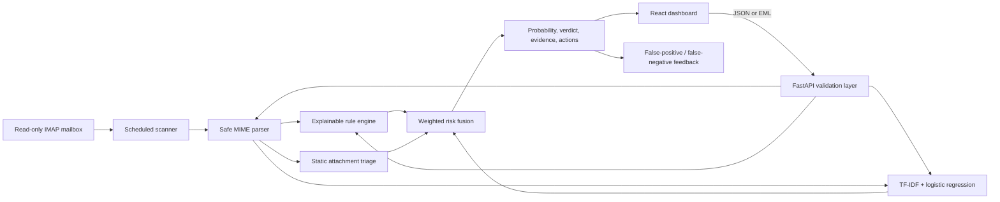

# PhishGuard AI

A phishing email detector that combines a trained text classifier with deterministic
security rules. It accepts pasted messages and `.eml` files, assigns a 0-100% phishing probability, and shows the
signals behind its verdict without visiting links or executing attachments.

> Advisory only: PhishGuard can be wrong. Do not use it as the sole basis for a security decision.

## Why this project

Black-box predictions are awkward in security. PhishGuard pairs TF-IDF logistic regression with transparent checks
for credential requests, urgency, risky payments, sender impersonation, URL shorteners, raw-IP links, suspicious
top-level domains, malformed senders, email authentication failures, organization context, and static attachment
risk indicators. Users see component scores, concrete evidence, and recommended actions.

## Demo

Run the project and open [http://localhost:8080](http://localhost:8080). The interface includes safe and suspicious
inert samples for a quick recruiter-friendly demonstration.

```bash
docker compose up --build
```

## Architecture



## Detection methodology

- **Rules:** auditable indicators such as credential language, pressure, payment requests, brand/free-mail mismatch,
  failed SPF/DKIM/DMARC results, reply-to mismatch, Unicode obfuscation, suspicious URL structure, aggressive
  formatting, and lookalike sender domains.
- **Model:** a scikit-learn feature union combining word/bigram TF-IDF with character 3-5 grams and class-weighted
  logistic regression. Character features make simple spelling substitutions and obfuscation harder to use as an
  evasion technique.
- **Attachment triage:** `.eml` uploads are statically inspected for risky metadata and byte patterns such as
  executable/script extensions, misleading double extensions, macro-enabled Office files, suspicious PDF features,
  oversized files, and ZIP contents with strict limits. Files are never executed, rendered, or extracted to disk.
- **Organization context:** optional trusted domains and known sender addresses reduce risk slightly, while lookalike
  domains raise risk. Trusted context never automatically marks an email safe; risky links, failed authentication,
  suspicious language, or attachments can still drive a warning.
- **Feedback loop:** users can label false positives, false negatives, and correct decisions by analysis ID. The
  feedback log intentionally avoids storing full email bodies so it can support future tuning with less privacy risk.
- **Fusion:** bounded weighted scoring maps to `Safe` (<35), `Suspicious` (35-69.9), or `Likely Phishing` (>=70).

The parser reads plain-text MIME parts, caps input size, limits attachment inspection, and never performs network
requests.

## Model evaluation

The repository ships a versioned model trained on a tiny, inert synthetic dataset so every clone is immediately
reproducible. The generated `docs/model-metrics.json` values are smoke-test metrics, not an accuracy claim. A credible
benchmark requires a larger, current, deduplicated corpus and group-aware splitting by campaign/source.

The training pipeline supports local CSV data with `text,label` columns. Recommended primary sources and licensing
notes are documented in [`ml/README.md`](ml/README.md). Exact duplicates are removed before the stratified split.
Recall is favored using phishing class weighting, accepting a potential increase in false positives.

```bash
python ml/train.py --dataset path/to/local_dataset.csv
```

## API

Interactive OpenAPI documentation is available at [http://localhost:8000/docs](http://localhost:8000/docs).

```bash
curl -X POST http://localhost:8000/api/analyze \
  -H "Content-Type: application/json" \
  -d '{"sender":"Maya <maya@example.org>","subject":"Notes","body":"See you Thursday."}'
```

`POST /api/analyze-eml` accepts multipart field `file`. Only `.eml` uploads are allowed; attachments are statically
triaged but never opened, executed, or sent to external services. When trusted mail headers are available, the detector
also evaluates authentication results and sender/reply-to alignment.

`POST /api/feedback` accepts an `analysis_id`, label, and optional note. Valid labels are `safe`, `suspicious`,
`phishing`, `false_positive`, and `false_negative`.

Set `PHISHGUARD_API_KEY` to require `X-API-Key` on analysis endpoints in non-browser deployments.

Organization context can be configured through environment variables:

```bash
PHISHGUARD_TRUSTED_DOMAINS=example.com,subsidiary.example
PHISHGUARD_TRUSTED_SENDERS=security@example.com,it-helpdesk@example.com
PHISHGUARD_PROTECTED_BRANDS=microsoft,google,paypal,example
```

## Automatic mailbox monitoring

The optional worker connects to standards-compliant IMAP over TLS and scans unseen messages on a schedule:

```bash
cp .env.example .env
# Fill in PHISHGUARD_MAILBOX_HOST, USERNAME, and either an app password or OAuth2 access token.
docker compose --profile mailbox up --build
```

Security properties:

- Opens the selected folder with `readonly=True`.
- Fetches with `BODY.PEEK[]`, so scanning does not mark a message as read.
- Never follows URLs, renders HTML, executes attachments, or executes message content.
- Caps message size and MIME-part count to reduce parser/resource-exhaustion risk.
- Stores only SHA-256 fingerprints for deduplication and limited alert metadata, never message bodies, in a private
  Docker volume.
- Supports an app password or OAuth2 bearer token exclusively through environment variables.
- Logs errors by type without printing mailbox credentials or full message bodies.

Use a dedicated least-privilege mailbox account where possible. Provider configuration differs: Gmail generally
requires an app password or OAuth2; enterprise Microsoft 365 deployments commonly require OAuth2 and administrator
approval. The worker intentionally does not delete, move, label, reply to, or quarantine messages.

## Local development

Backend:

```bash
cd backend
python -m venv .venv
. .venv/bin/activate
pip install -r requirements-dev.txt
pytest --cov=app
uvicorn app.main:app --reload
```

Frontend:

```bash
cd frontend
npm install
npm run dev
```

Copy `.env.example` to `.env` only when overriding defaults. Never commit real email, credentials, or secrets.

## Security and privacy

- Links are extracted as strings only; the application does not resolve, fetch, or render them.
- Attachments are inspected only with static metadata/byte-pattern checks; they are not executed, rendered, or
  uploaded to third-party scanners.
- Feedback stores analysis IDs, labels, timestamps, and optional notes instead of full private email bodies.
- Input is validated and size-limited; errors avoid echoing submitted email content into logs.
- The demo has no database and retains no messages.
- Production use should enable the optional API key and add TLS termination, rate limits, malware isolation, further
  redaction, and a documented retention policy.

## Tests and automation

GitHub Actions runs Ruff, pytest with an 80% coverage floor, `pip-audit`, the TypeScript production build, and Docker
Compose builds. Run the main checks locally:

```bash
cd backend && ruff check app tests ../ml && pytest --cov=app --cov-fail-under=80
cd ../frontend && npm run build
docker compose build
```

## Limitations and future work

- The bundled model is a reproducible demonstration, not a production benchmark.
- Static attachment triage is not malware detonation and cannot prove a file is safe.
- Text-focused analysis cannot yet inspect QR codes, image-only scams, or live domain reputation.
- SPF, DKIM, and DMARC findings are useful only when the supplied headers came from a trusted mail server.
- Character features improve resistance to simple obfuscation but not new languages or novel social engineering.
- Automatic mailbox scanning is detection-only and deliberately does not quarantine or modify messages.
- Future work: campaign-grouped evaluation, multilingual models, SHAP-style feature explanations, feedback review,
  attachment sandboxing in an isolated VM, QR/OCR analysis, privacy-conscious domain reputation, and drift monitoring.

## What I learned

This project strengthened my ability to turn an ML experiment into a usable security product: safe MIME parsing,
explainable scoring, leakage-aware evaluation, typed API design, accessible UI work, containerization, and CI security
checks. The most important lesson was that honest uncertainty and useful explanations matter as much as a headline
accuracy number.

## License

MIT
