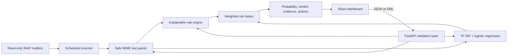

# PhishGuard AI

An explainable, portfolio-grade phishing email detector that combines a trained text classifier with deterministic
security rules. It accepts pasted messages and `.eml` files, assigns a 0–100% phishing probability, and shows the
signals behind its verdict—without visiting links or opening attachments.

> **Advisory only:** PhishGuard can be wrong. Do not use it as the sole basis for a security decision.

## Why this project

Black-box predictions are awkward in security. PhishGuard pairs TF-IDF logistic regression with transparent checks
for credential requests, urgency, risky payments, sender impersonation, URL shorteners, raw-IP links, suspicious
top-level domains, and malformed senders. Users see both component scores and concrete recommended actions.

## Demo

Run the project and open [http://localhost:8080](http://localhost:8080). The interface includes safe and suspicious
inert samples for a quick recruiter-friendly demonstration.

```bash
docker compose up --build
```

## Architecture



## Detection methodology

- **Rules (42%):** high-signal, auditable indicators such as credential language, pressure, payment requests,
  brand/free-mail mismatches, failed SPF/DKIM/DMARC results, reply-to mismatches, Unicode obfuscation, suspicious
  URL structure, and aggressive formatting.
- **Model (58%):** a scikit-learn feature union combining word/bigram TF-IDF with character 3–5 grams and
  class-weighted logistic regression. Character features make simple spelling substitutions and obfuscation harder
  to use as an evasion technique.
- **Fusion:** bounded weighted scoring maps to `Safe` (<35), `Suspicious` (35–69.9), or `Likely Phishing` (≥70).

The parser reads only plain-text MIME parts, skips attachments, caps input size, and never performs network requests.

## Model evaluation

The repository ships a versioned model trained on a tiny, inert synthetic dataset so every clone is immediately
reproducible. The generated `docs/model-metrics.json` values are **smoke-test metrics, not an accuracy claim**.
A credible benchmark requires a larger, current, deduplicated corpus and group-aware splitting by campaign/source.

The training pipeline supports local CSV data with `text,label` columns. Recommended primary sources and licensing
notes are documented in [`ml/README.md`](ml/README.md). Exact duplicates are removed before the stratified split.
Recall is favored using phishing class weighting, accepting a potential increase in false positives.

```bash
python ml/train.py --dataset path/to/local_dataset.csv
```

## API

Interactive OpenAPI documentation is available at [http://localhost:8000/docs](http://localhost:8000/docs).

```bash
curl -X POST http://localhost:8000/api/analyze \
  -H "Content-Type: application/json" \
  -d '{"sender":"Maya <maya@example.org>","subject":"Notes","body":"See you Thursday."}'
```

`POST /api/analyze-eml` accepts multipart field `file`. Only `.eml` uploads are allowed; attachments are ignored.
When trusted mail headers are available, the detector also evaluates authentication results and sender/reply-to
alignment. Set `PHISHGUARD_API_KEY` to require `X-API-Key` on analysis endpoints in non-browser deployments.

## Automatic mailbox monitoring

The optional worker connects to standards-compliant IMAP over TLS and scans unseen messages on a schedule:

```bash
cp .env.example .env
# Fill in PHISHGUARD_MAILBOX_HOST, USERNAME, and either an app password or OAuth2 access token.
docker compose --profile mailbox up --build
```

Security properties:

- Opens the selected folder with `readonly=True`.
- Fetches with `BODY.PEEK[]`, so scanning does not mark a message as read.
- Never follows URLs, renders HTML, opens attachments, or executes message content.
- Caps message size and MIME-part count to reduce parser/resource-exhaustion risk.
- Stores only SHA-256 fingerprints for deduplication and limited alert metadata—never message bodies—in a private
  Docker volume.
- Supports an app password or OAuth2 bearer token exclusively through environment variables.
- Logs errors by type without printing mailbox credentials or full message bodies.

Use a dedicated least-privilege mailbox account where possible. Provider configuration differs: Gmail generally
requires an app password or OAuth2; enterprise Microsoft 365 deployments commonly require OAuth2 and administrator
approval. The worker intentionally does not delete, move, label, reply to, or quarantine messages.

## Local development

Backend:

```bash
cd backend
python -m venv .venv
. .venv/bin/activate
pip install -r requirements-dev.txt
pytest --cov=app
uvicorn app.main:app --reload
```

Frontend:

```bash
cd frontend
npm install
npm run dev
```

Copy `.env.example` to `.env` only when overriding defaults. Never commit real email, credentials, or secrets.

## Security and privacy

- Links are extracted as strings only; the application does not resolve, fetch, or render them.
- Attachments and HTML MIME parts are ignored.
- Input is validated and size-limited; errors avoid echoing submitted email content into logs.
- The demo has no database and retains no messages.
- Production use should enable the optional API key and add TLS termination, rate limits, malware isolation,
  further redaction, and a documented retention policy.

## Tests and automation

GitHub Actions runs Ruff, pytest with an 80% coverage floor, `pip-audit`, the TypeScript production build, and Docker
Compose builds. Run the main checks locally:

```bash
cd backend && ruff check app tests ../ml && pytest --cov=app --cov-fail-under=80
cd ../frontend && npm run build
docker compose build
```

## Limitations and future work

- The bundled model is a reproducible demonstration, not a production benchmark.
- Text-only analysis cannot inspect images, QR codes, attachment contents, or live domain reputation.
- SPF, DKIM, and DMARC findings are useful only when the supplied headers came from a trusted mail server.
- Character features improve resistance to simple obfuscation but not new languages or novel social engineering.
- Automatic mailbox scanning is detection-only and deliberately does not quarantine or modify messages.
- Future work: campaign-grouped evaluation, multilingual models, SHAP-style feature explanations, authenticated
  analyst feedback, domain reputation through a privacy-conscious service, and drift monitoring.

## What I learned

This project strengthened my ability to turn an ML experiment into a usable security product: safe MIME parsing,
explainable scoring, leakage-aware evaluation, typed API design, accessible UI work, containerization, and CI
security checks. The most important lesson was that honest uncertainty and useful explanations matter as much as a
headline accuracy number.

## License

MIT
