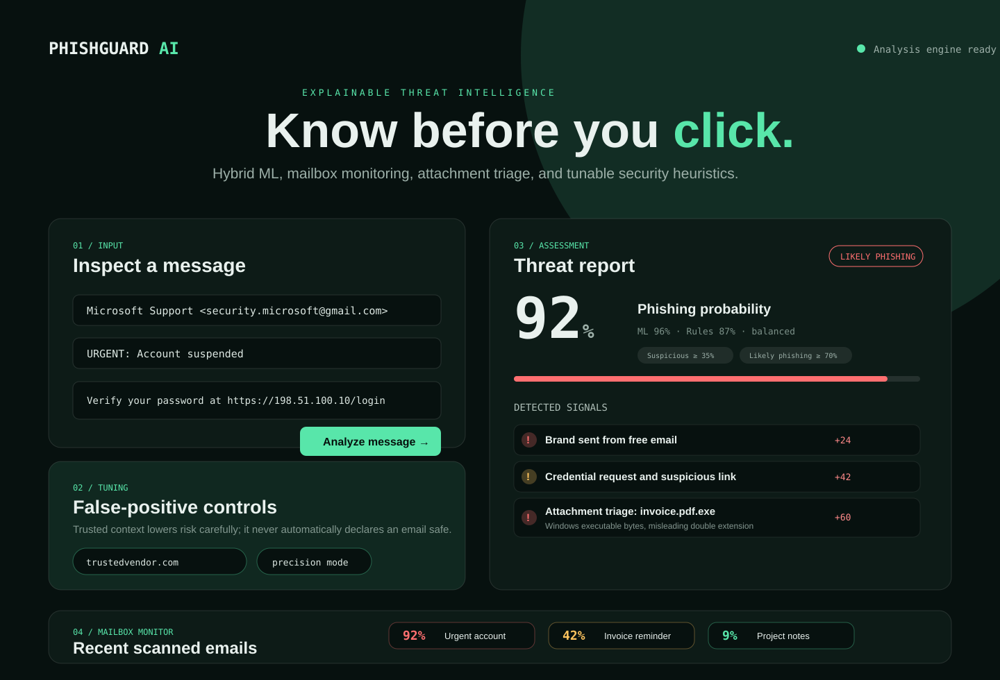
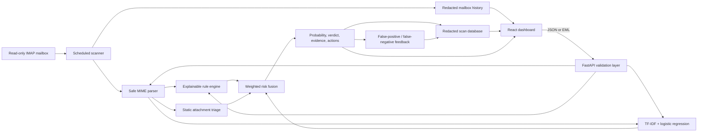

# PhishGuard AI

A phishing email detector that combines a trained text classifier with deterministic
security rules. It accepts pasted messages and `.eml` files, assigns a 0-100% phishing probability, and shows the
signals behind its verdict without visiting links or executing attachments.

> Advisory only: PhishGuard can be wrong. Do not use it as the sole basis for a security decision.

## Why this project

Black-box predictions are awkward in security. PhishGuard pairs TF-IDF logistic regression with transparent checks
for credential requests, urgency, risky payments, sender impersonation, URL shorteners, raw-IP links, suspicious
top-level domains, malformed senders, email authentication failures, organization context, and static attachment
risk indicators. Users see component scores, concrete evidence, and recommended actions.

## Demo

Run the project and open [http://localhost:8080](http://localhost:8080). The interface includes safe and suspicious
inert samples for a quick recruiter-friendly demonstration.



```bash
docker compose up --build
```

## Architecture



## Detection methodology

- **Rules:** auditable indicators such as credential language, pressure, payment requests, brand/free-mail mismatch,
  failed SPF/DKIM/DMARC results, reply-to mismatch, Unicode obfuscation, suspicious URL structure, aggressive
  formatting, and lookalike sender domains.
- **Model:** a scikit-learn feature union combining word/bigram TF-IDF with character 3-5 grams and class-weighted
  logistic regression. Character features make simple spelling substitutions and obfuscation harder to use as an
  evasion technique.
- **Attachment triage:** `.eml` uploads are statically inspected for risky metadata and byte patterns such as
  executable/script extensions, misleading double extensions, mismatched magic bytes, macro-enabled Office files,
  risky RTF object markers, suspicious PDF actions/forms, HTML forms/scripts, encrypted or oversized archives, and
  ZIP contents with strict limits. Files are never executed, rendered, or extracted to disk.
- **Organization context:** optional trusted domains and known sender addresses reduce risk slightly, while lookalike
  domains raise risk. Trusted context never automatically marks an email safe; risky links, failed authentication,
  suspicious language, or attachments can still drive a warning.
- **False-positive controls:** analysts can choose balanced, recall-focused, or precision-focused sensitivity.
  Model-only risk without supporting rule or attachment evidence is capped below the suspicious threshold to reduce
  noisy warnings on ordinary business email.
- **Feedback loop:** users can label false positives, false negatives, and correct decisions by analysis ID. The
  feedback log intentionally avoids storing full email bodies so it can support future tuning with less privacy risk.
- **SaaS foundation:** local signup/login issues signed bearer tokens tied to users, organizations, and roles. Demo
  `X-Org-ID` and `X-User-ID` headers remain available for quick local testing. Redacted scan history and feedback are
  persisted in SQLite for local demos, with a clean migration path to managed PostgreSQL.
- **Product dashboard:** workspace settings, dashboard metrics, scan history, usage metering, subscription scaffolding,
  audit logs, compliance export/delete, security posture, read-only Gmail/Outlook OAuth connection scaffolding, and
  safe threat-intelligence preview endpoints model the structure needed for a future SaaS.
- **Mailbox dashboard:** automatic scans write a redacted history containing sender, subject, verdict, score, top
  reasons, attachment count, hashes, and analysis ID. Full email bodies are not stored by default.
- **Fusion:** bounded weighted scoring maps to `Safe` (<35), `Suspicious` (35-69.9), or `Likely Phishing` (>=70).

The parser reads plain-text MIME parts, caps input size, limits attachment inspection, and never performs network
requests.

## Model evaluation

The repository ships a versioned `phishguard-v3` model trained on the public
[`zefang-liu/phishing-email-dataset`](https://huggingface.co/datasets/zefang-liu/phishing-email-dataset)
corpus (`lgpl-3.0`). The raw corpus is downloaded locally and is not committed.

Held-out evaluation after exact-text deduplication:

| Mode | Precision | Recall | F1 | False-positive rate |
|---|---:|---:|---:|---:|
| Default threshold | 0.9793 | 0.9841 | 0.9817 | 0.0124 |
| Recall-focused threshold | 0.9102 | 0.9969 | 0.9516 | 0.0587 |

The recall-focused threshold catches more phishing messages but increases false positives. Full metrics, confusion
matrices, leakage controls, and limitations are documented in [`docs/model-evaluation.md`](docs/model-evaluation.md).

Reproduce the benchmark:

```bash
python ml/fetch_public_dataset.py
python ml/train.py --dataset data/processed/phishing_email_dataset.csv \
  --source-name zefang-liu/phishing-email-dataset \
  --source-url https://huggingface.co/datasets/zefang-liu/phishing-email-dataset \
  --source-license lgpl-3.0
```

## API

Interactive OpenAPI documentation is available at [http://localhost:8000/docs](http://localhost:8000/docs).

```bash
curl -X POST http://localhost:8000/api/analyze \
  -H "Content-Type: application/json" \
  -d '{"sender":"Maya <maya@example.org>","subject":"Notes","body":"See you Thursday.","trusted_domains":["example.org"],"sensitivity":"precision"}'
```

`POST /api/analyze-eml` accepts multipart field `file`. Only `.eml` uploads are allowed; attachments are statically
triaged but never opened, executed, or sent to external services. When trusted mail headers are available, the detector
also evaluates authentication results and sender/reply-to alignment.

`POST /api/feedback` accepts an `analysis_id`, label, and optional note. Valid labels are `safe`, `suspicious`,
`phishing`, `false_positive`, and `false_negative`.

`POST /api/auth/signup` creates a local user, organization, owner membership, and signed bearer token.

`POST /api/auth/login` verifies a password hash and returns a bearer token. Send it as
`Authorization: Bearer <token>` to use organization-scoped endpoints without demo tenant headers.

`GET /api/me` returns the current user, organization, role, auth mode, and permissions.

`GET /api/org` returns the current organization and member list.

`GET /api/org/settings` and `PUT /api/org/settings` manage trusted domains, known senders, sensitivity, retention,
privacy mode, and mailbox alert threshold for a workspace.

`GET /api/dashboard/metrics` returns SaaS-style summary metrics such as total scans, verdict counts, false positives,
attachment scans, and top risk factors.

`GET /api/billing/subscription`, `PUT /api/billing/subscription`, and `GET /api/billing/usage` provide billing-ready
plan state and monthly scan usage. Plan enforcement is off by default for demos and can be enabled with
`PHISHGUARD_ENFORCE_PLAN_LIMITS=true`.

`GET /api/audit/events` returns tenant-scoped audit events for scans, feedback, settings changes, subscription changes,
and compliance actions.

`GET /api/compliance/export` returns redacted tenant data for review or account export. `DELETE /api/compliance/data`
deletes tenant scan history and optional feedback/audit records after an explicit organization confirmation payload.

`GET /api/security/posture` summarizes active controls and production launch gaps, making it easier to review whether
the API is safe to expose beyond local demos.

`GET /api/scans/history` returns recent tenant-scoped, redacted scan records. Use `X-Org-ID` and `X-User-ID` headers
to simulate workspace/user context in local demos. The response includes a body hash, not the message body.

`POST /api/threat-intel/preview` extracts URL domains and shows which reputation providers are scaffolded. It does not
perform external lookups by default.

`GET /api/oauth/gmail/connect` and `GET /api/oauth/outlook/connect` generate read-only OAuth authorization URLs.
`POST /api/oauth/callback` or `GET /api/oauth/{provider}/callback` validates OAuth state and records the connection.
`GET /api/oauth/integrations` lists connected providers and `DELETE /api/oauth/{provider}` disconnects one. The
callback stores a pending token-exchange record; production should exchange provider codes server-side and encrypt
refresh tokens with a managed KMS.

`GET /api/mailbox/history` returns recent redacted mailbox scan records for the dashboard. It does not include message
bodies.

Set `PHISHGUARD_API_KEY` to require `X-API-Key` on analysis endpoints in non-browser deployments.

Optional detection tuning:

```bash
PHISHGUARD_SUSPICIOUS_THRESHOLD=35
PHISHGUARD_LIKELY_PHISHING_THRESHOLD=70
PHISHGUARD_RATE_LIMIT_REQUESTS=120
PHISHGUARD_RATE_LIMIT_WINDOW_SECONDS=60
PHISHGUARD_DATABASE_ENABLED=true
PHISHGUARD_DATABASE_URL=sqlite:////tmp/phishguard.sqlite3
PHISHGUARD_DATABASE_PATH=/tmp/phishguard.sqlite3
PHISHGUARD_STORE_EMAIL_BODIES=false
PHISHGUARD_SCAN_RETENTION_DAYS=30
PHISHGUARD_AUTH_MODE=local
PHISHGUARD_AUTH_SECRET_KEY=change-me-use-a-long-random-secret
PHISHGUARD_AUTH_TOKEN_TTL_SECONDS=86400
PHISHGUARD_PASSWORD_HASH_ITERATIONS=210000
PHISHGUARD_DEFAULT_PLAN=starter
PHISHGUARD_ENFORCE_PLAN_LIMITS=false
PHISHGUARD_THREAT_INTEL_ENABLED=false
PHISHGUARD_THREAT_INTEL_PROVIDERS=google_safe_browsing,virustotal,urlhaus
PHISHGUARD_PUBLIC_BASE_URL=http://localhost:8000
PHISHGUARD_FRONTEND_BASE_URL=http://localhost:5173
PHISHGUARD_OAUTH_TOKEN_ENCRYPTION_KEY=change-me-use-a-long-random-oauth-secret
PHISHGUARD_GMAIL_OAUTH_CLIENT_ID=
PHISHGUARD_OUTLOOK_OAUTH_CLIENT_ID=
```

Organization context can be configured through environment variables:

```bash
PHISHGUARD_TRUSTED_DOMAINS=example.com,subsidiary.example
PHISHGUARD_TRUSTED_SENDERS=security@example.com,it-helpdesk@example.com
PHISHGUARD_PROTECTED_BRANDS=microsoft,google,paypal,example
```

## Automatic mailbox monitoring

The optional worker connects to standards-compliant IMAP over TLS and scans unseen messages on a schedule:

```bash
cp .env.example .env
# Fill in PHISHGUARD_MAILBOX_HOST, USERNAME, and either an app password or OAuth2 access token.
docker compose --profile mailbox up --build
```

Security properties:

- Opens the selected folder with `readonly=True`.
- Fetches with `BODY.PEEK[]`, so scanning does not mark a message as read.
- Never follows URLs, renders HTML, executes attachments, or executes message content.
- Caps message size and MIME-part count to reduce parser/resource-exhaustion risk.
- Stores only SHA-256 fingerprints, redacted scan history, and limited alert metadata, never message bodies, in a
  private Docker volume.
- Supports an app password or OAuth2 bearer token exclusively through environment variables.
- Logs errors by type without printing mailbox credentials or full message bodies.

Use a dedicated least-privilege mailbox account where possible. Provider configuration differs: Gmail generally
requires an app password or OAuth2; enterprise Microsoft 365 deployments commonly require OAuth2 and administrator
approval. The worker intentionally does not delete, move, label, reply to, or quarantine messages.

## Local development

Backend:

```bash
cd backend
python -m venv .venv
. .venv/bin/activate
pip install -r requirements-dev.txt
pytest --cov=app
uvicorn app.main:app --reload
```

Frontend:

```bash
cd frontend
npm install
npm run dev
```

Copy `.env.example` to `.env` only when overriding defaults. Never commit real email, credentials, or secrets.

## SaaS roadmap

The current implementation includes the first product-grade foundation: tenant-aware context, redacted persisted scan
history, feedback events, workspace settings, dashboard metrics, local bearer-token authentication, organization
memberships, read-only Gmail/Outlook OAuth connection scaffolding, subscription and usage-metering scaffolding, audit
events, compliance export/delete workflows, security posture reporting, safe threat-intelligence scaffolding,
retention settings, and Docker volume persistence. The path to managed identity, PostgreSQL, production OAuth token
exchange, threat-intelligence APIs, deployment, and Stripe billing is documented in
[`docs/saas-roadmap.md`](docs/saas-roadmap.md). A practical launch checklist is in
[`docs/deployment-guide.md`](docs/deployment-guide.md).

## Security and privacy

- Links are extracted as strings only; the application does not resolve, fetch, or render them.
- Attachments are inspected only with static metadata/byte-pattern checks; they are not executed, rendered, or
  uploaded to third-party scanners.
- Feedback stores analysis IDs, labels, timestamps, and optional notes instead of full private email bodies.
- Scan history stores redacted metadata and SHA-256 body hashes by default, not full message bodies.
- Local passwords are hashed with PBKDF2-HMAC-SHA256 and API sessions use signed bearer tokens.
- OAuth state is short-lived and provider callbacks are protected against CSRF-style replay. Production deployments
  should exchange provider codes server-side and encrypt refresh tokens using a managed secret/KMS service.
- Compliance export/delete endpoints operate on tenant-scoped redacted records and require explicit org confirmation
  before deletion.
- Audit events make settings, feedback, scans, subscription updates, and compliance actions traceable.
- Input is validated and size-limited; errors avoid echoing submitted email content into logs.
- API endpoints include simple in-memory rate limiting to reduce accidental abuse in small deployments.
- Local Docker demos persist redacted history in a named volume; delete the volume to clear local state.
- Production use should enable the optional API key and add TLS termination, rate limits, malware isolation, further
  redaction, and a documented retention policy.

## Tests and automation

GitHub Actions runs Ruff, pytest with an 80% coverage floor, `pip-audit`, the TypeScript production build, and Docker
Compose builds. Security workflows also run CodeQL static analysis and pull-request dependency review for high-severity
package changes. Run the main checks locally:

```bash
cd backend && ruff check app tests ../ml && pytest --cov=app --cov-fail-under=80
cd ../frontend && npm run build
docker compose build
```

## Limitations and future work

- The benchmark uses a public historical corpus and is not a guarantee of production performance.
- The split is stratified but not campaign-grouped because the normalized public CSV does not provide campaign IDs.
- Static attachment triage is not malware detonation and cannot prove a file is safe.
- Text-focused analysis cannot yet inspect QR codes, image-only scams, or live domain reputation.
- SPF, DKIM, and DMARC findings are useful only when the supplied headers came from a trusted mail server.
- Character features improve resistance to simple obfuscation but not new languages or novel social engineering.
- Automatic mailbox scanning is detection-only and deliberately does not quarantine or modify messages.
- Local auth is suitable for a serious demo/MVP but a public SaaS should consider a managed identity provider,
  MFA, email verification, password reset, account lockout, and session revocation.
- Future work: campaign-grouped evaluation, multilingual models, SHAP-style feature explanations, feedback review,
  PostgreSQL migrations, OAuth mailbox integrations, attachment sandboxing in an isolated VM, QR/OCR analysis,
  privacy-conscious domain reputation, billing, and drift monitoring.

## What I learned

This project strengthened my ability to turn an ML experiment into a usable security product: safe MIME parsing,
explainable scoring, leakage-aware evaluation, typed API design, accessible UI work, containerization, and CI security
checks. The most important lesson was that honest uncertainty and useful explanations matter as much as a headline
accuracy number.

## License

MIT
